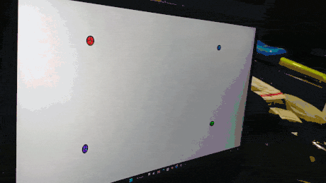
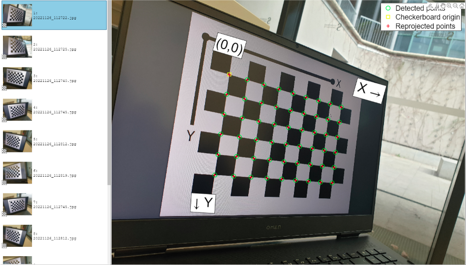
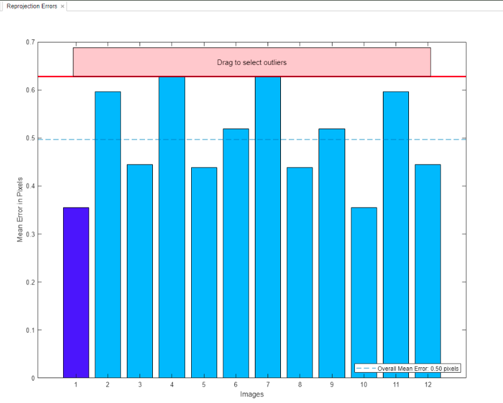
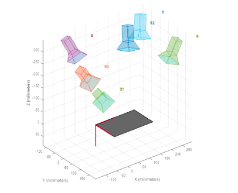
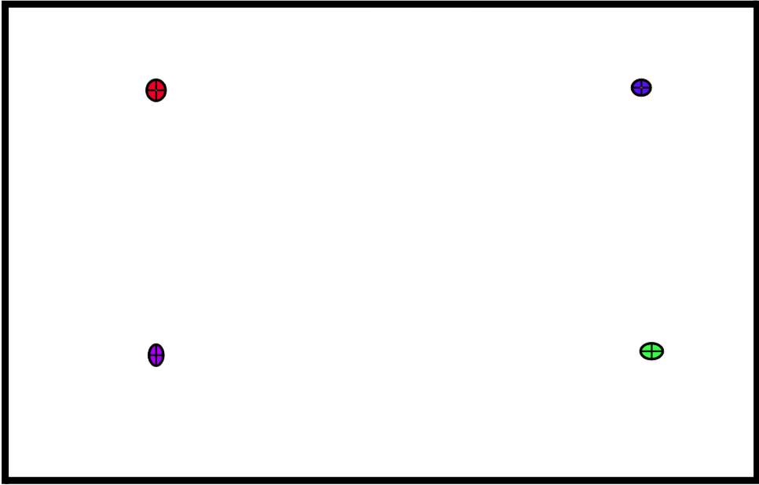
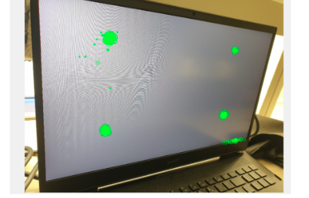
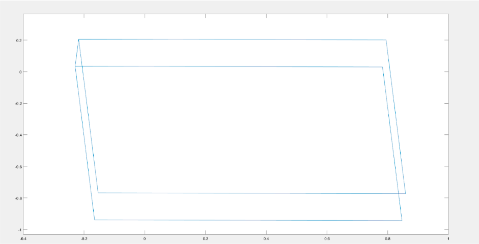

# 🎯 Augmented Reality in MATLAB
### Planar Homography → Camera Pose → 3D Cube Projection + KAZE Tracking

**Course:** MU4RBI09 – Vision par ordinateur  
**Instructor:** Xavier Clady  
**Team:** Leo Bellali & Edouard David (M1 ISI | CMI EEA)

We built a complete **Augmented Reality pipeline** on a **planar target**: calibrate the camera (**K**), estimate a homography (**H**),
recover pose (**R, t**), and project a **3D cube** onto real frames using **KAZE-based tracking**.

---

## 🎬 Demo (what you see first)

  

---

## 🧭 Pipeline at a glance (then the roadmap)

  

1. **Calibrate camera** → intrinsics **K**  
2. **Estimate homography** (**H**) with Normalized DLT  
3. **Recover pose** from \(K^{-1}H\) → **R, t**  
4. Build \(P = K[R|t]\)  
5. **Project cube** on images/video  
6. **Track features** (KAZE / PointTracker) → update \(H_t\) each frame

---

## 📸 Results as an “article” (in the same order as the method)

### 1) Camera calibration (source of **K**)

  

**Quality check:** mean reprojection error per calibration image (used to discard outliers)

  

**Coverage:** estimated camera poses around the plane (good viewpoint diversity)

  

---

### 2) Planar target (what the homography is computed on)

  

---

### 3) Feature detection & tracking (how the video stays stable)

  

---

### 4) Projection sanity check (math works before full overlay)

  

---

## 🧠 Method (Math)

### 1) Pinhole camera model
\[
\mathbf{x} \sim \mathbf{P}\mathbf{X}, \quad \mathbf{P}=\mathbf{K}[\mathbf{R}\mid \mathbf{t}]
\]

### 2) Planar homography
\[
\mathbf{x} \sim \mathbf{H}\mathbf{X}_{plane}
\]
Estimated using **Normalized DLT** (centroid → origin, mean distance → \(\sqrt{2}\)):
\[
\mathbf{H} = \mathbf{T'}^{-1}\tilde{\mathbf{H}}\mathbf{T}
\]

### 3) Pose from homography
Let \(\mathbf{B}=\mathbf{K}^{-1}\mathbf{H}=[\mathbf{b}_1\ \mathbf{b}_2\ \mathbf{b}_3]\).  
\[
\lambda = \frac{1}{\|\mathbf{b}_1\|},\quad
\mathbf{r}_1=\lambda\mathbf{b}_1,\ 
\mathbf{r}_2=\lambda\mathbf{b}_2,\ 
\mathbf{r}_3=\mathbf{r}_1\times\mathbf{r}_2,\ 
\mathbf{t}=\lambda\mathbf{b}_3
\]
Then enforce a valid rotation \(\det(\mathbf{R})=1\).

### 4) Cube projection
\[
\mathbf{x} \sim \mathbf{P}\mathbf{X}
\]
Project vertices and draw cube edges.

---

## 🔍 Tracking (Video Augmentation)

For each frame \(t\):
1. track points/features on the planar target  
2. estimate homography \(H_t\)  
3. recover pose \((R_t,t_t)\)  
4. build \(P_t\) and project the cube  

KAZE was used for more stable keypoints under scale/blur/compression compared to basic corners.

---

## ▶️ Getting Started

### Requirements
- MATLAB
- Computer Vision Toolbox

### Run order
1. `Homography.mlx` — correspondences + normalized DLT → **H**  
2. `Augmented_REALITY.m` — pose + cube projection on a frame  
3. `ProjectionMatrixVideo.mlx` — tracking + per-frame homography + overlay  

---

## 📁 Suggested Repository Layout

